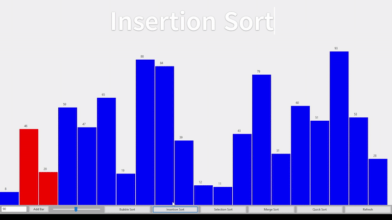

# Sorting Algorithm Visualizer

An interactive desktop application built with C++ and wxWidgets to visualize popular sorting algorithms.  
This tool is designed to help users understand how different sorting algorithms work through real-time graphical representations.

## Features

- **Sorting Algorithms Implemented:**
  - Bubble Sort
  - Merge Sort
  - Selection Sort
  - Insertion Sort

- **Interactive Controls:**
  - **Add Custom Bar**: Allows users to add a bar of a specific height to the array.
  - **Speed Slider**: Dynamically control the speed of the sorting animation.
  - **Refresh Button**: Resets the array to its initial unsorted state.
  - **Sorting Buttons**: Dedicated buttons to initiate each sorting algorithm.

- **Real-Time Visualization:**
  - Graphical representation of sorting processes.
  - Dynamic updates to the array as sorting progresses.

## Demo



## Prerequisites

- **wxWidgets Library:**
  - Ensure that wxWidgets is installed on your system.
  - For installation instructions, visit the [wxWidgets official website](https://www.wxwidgets.org/downloads/).

- **C++ Compiler:**
  - A compiler that supports C++11 or later.

## Building and Running the Application

### Clone the Repository:
```bash
    git clone https://github.com/AlyanGulzar/Sorting-Algorithm-Visualizer.git
   cd Sorting-Algorithm-Visualizer
   ```
### Configure the Build:
- Use your preferred build system (e.g., CMake or Code::Blocks) to configure the project.
- Make sure the wxWidgets environment is set up correctly on your machine.

### Build the Project:
- Compile the project using your selected IDE or compiler.

### Run the Application:
- Execute the compiled binary to launch the Sorting Algorithm Visualizer.

---

## 🎮 Usage

- **Add Custom Bar**: Input a height and add a new bar to the array.
- **Adjust Speed**: Use the speed slider to increase or decrease the sorting animation speed.
- **Start Sorting**: Click any sorting algorithm button (Bubble, Merge, Selection, Insertion) to visualize that algorithm.
- **Refresh**: Use the refresh button to clear and regenerate the bar array.

---

## 🤝 Contributing

Contributions are welcome! If you'd like to enhance the application or fix issues, follow these steps:

1. **Fork the repository.**

2. **Create a new branch:**
   ```bash
   git checkout -b feature/YourFeatureName
   ```

3. **Make your changes and commit:**
   ```bash
   git commit -m "Add your message here"
   ```

4. **Push to your fork:**
   ```bash
   git push origin feature/YourFeatureName
   ```

5. **Open a pull request on GitHub.**

---

## 📄 License

This project is licensed under the MIT License.
